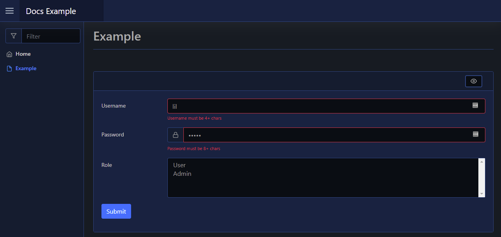

# Validation

This page details the available output actions available to input form element Validation messages.

## Out

To show an error validation message beneath an element - usually form input elements - you can use [`Out-PodeWebValidation`](../../../Functions/Outputs/Out-PodeWebValidation). This will turn the element red, and show a red message beneath it - useful for username lengths, etc:

```powershell
New-PodeWebCard -Content @(
    New-PodeWebForm -Name 'Example' -ScriptBlock {
        $invalid = $false

        if ($WebEvent.Data['Username'].Length -le 3) {
            Out-PodeWebValidation -Name 'Username' -Message 'Username must be 4+ chars'
            $invalid = $true
        }

        if ($WebEvent.Data['Password'].Length -le 7) {
            Out-PodeWebValidation -Name 'Password' -Message 'Password must be 8+ chars'
            $invalid = $true
        }

        if ($invalid) {
            return
        }
    } -Content @(
        New-PodeWebTextbox -Name 'Username'
        New-PodeWebTextbox -Name 'Password' -Type Password -PrependIcon Lock
        New-PodeWebSelect -Name 'Role' -Options @('User', 'Admin') -Multiple
    )
)
```

Which would look like below:


