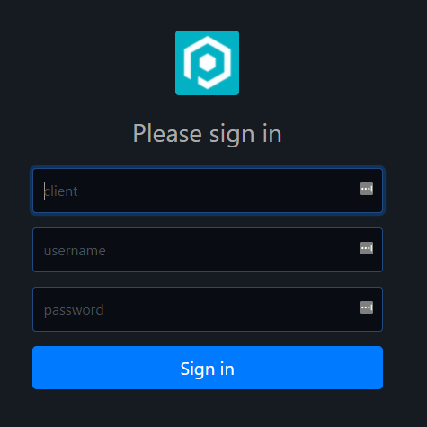

# Pages

There are 2 different kinds of pages in Pode.Web which are defined below. Other than the Login page, normal pages can be populated with custom elements. When you add pages to your site they appear on the sidebar for navigation - unless they are specified to be hidden from the sidebar.

## Login

To enable the use of a login page, and lock your site behind authentication, is simple! First, just set up sessions and define the authentication method you want via the usual `Enable-PodeSessionMiddleware`, `New-PodeAuthScheme`, and `Add-PodeAuth` in Pode. Then, pass the authentication name into [`Set-PodeWebLoginPage`](../../Functions/Pages/Set-PodeWebLoginPage) - and that's it!

!!! note
    Since the login page uses a form to log a user in, the best scheme to use is Forms: `New-PodeAuthScheme -Form`. OAuth2 also works, as the login page will automatically trigger the relevant redirects to your OAuth2 provider.

!!! important
    If you require a login page, then you **must** call [`Set-PodeWebLoginPage`](../../Functions/Pages/Set-PodeWebLoginPage) before you make any calls to [`Add-PodeWebPage`](../../Functions/Pages/Add-PodeWebPage).

```powershell
Enable-PodeSessionMiddleware -Duration 120 -Extend

New-PodeAuthScheme -Form | Add-PodeAuth -Name Example -ScriptBlock {
    param($username, $password)

    return @{
        User = @{
            ID ='M0R7Y302'
            Name = 'Morty'
            Type = 'Human'
        }
    }
}

Set-PodeWebLoginPage -Authentication Example
```

By default, the Pode icon is displayed as the logo but you can change this by using the `-Logo` parameter, this takes a literal or relative URL to an image file. If a relative URL is used then the image should be available as [public/static content](https://badgerati.github.io/Pode/Tutorials/Routes/Utilities/StaticContent/#public-directory).

### Paths

When a login page is configured, Pode will automatically set up the Routes for you at `/login` and `/logout`. You can customise these paths to meet your needs by supplying `-LoginPath` and/or `-LogoutPath` - when not supplied the default paths mentioned previously will be used.

For example, the following will configure a Login path but with the paths being `/auth/login` and `/auth/logout` instead.

```powershell
Set-PodeWebLoginPath -Authentication ExampleAuth -LoginPath '/auth/login' -LogoutPath '/auth/logout'
```

### IIS

If you're hosting the site using IIS, and want to use Windows Authentication within IIS, then you can set up authentication in Pode.Web via [`Set-PodeWebAuth`](../../Functions/Utilities/Set-PodeWebAuth). This works similarly to `Set-PodeWebLoginPage` and sets up authentication on the pages, but it doesn't cause a login page or the sign-in/out buttons to appear. Instead, Pode.Web gets the session from IIS, and then displays the logged-in user at the top - similar to how the login page would after a successful login.

```powershell
Enable-PodeSessionMiddleware -Duration 120 -Extend
Add-PodeAuthIIS -Name Example
Set-PodeWebAuth -Authentication Example
```

### Custom Fields

By default the Login page will display a login form with Username and Password inputs. This can be overridden by supplying custom Elements to the `-Content` parameter of [`Set-PodeWebLoginPage`](../../Functions/Pages/Set-PodeWebLoginPage). Any custom content will be placed between the "Please sign in" message and the "Sign In" button.

```powershell
# setup sessions
Enable-PodeSessionMiddleware -Duration 120 -Extend

# define a new custom authentication scheme, which needs a client, username, and password
$custom_scheme = New-PodeAuthScheme -Custom -ScriptBlock {
    param($opts)

    # get the client/user/password from the request's post data
    $client = $WebEvent.Data.client
    $username = $WebEvent.Data.username
    $password = $WebEvent.Data.password

    # return the data in a array, which will be passed to the validator script
    return @($client, $username, $password)
}

# now, add a new custom authentication validator using the scheme you created above
$custom_scheme | Add-PodeAuth -Name Example -ScriptBlock {
    param($client, $username, $password)

    # check if the client is valid in some database
    return @{
        User = @{
            ID ='M0R7Y302'
            Name = 'Morty'
            Type = 'Human'
        }
    }

    # return a user object (return $null if validation failed)
    return  @{ User = $user }
}

# set the login page to use the custom auth, and also custom login fields
Set-PodeWebLoginPage -Authentication Example -Content @(
    New-PodeWebTextbox -Type Text -Name 'client' -Id 'client' -Placeholder 'Client' -Required -AutoFocus -DynamicLabel
    New-PodeWebTextbox -Type Text -Name 'username' -Id 'username' -Placeholder 'Username' -Required -DynamicLabel
    New-PodeWebTextbox -Type Password -Name 'password' -Id 'password' -Placeholder 'Password' -Required -DynamicLabel
)
```

Which would look like below:



## Page

By adding a page to your site Pode.Web will add a link to it on your site's sidebar navigation. You can also group pages so you can collapse groups of them. To add a page to your site you use [`Add-PodeWebPage`](../../Functions/Pages/Add-PodeWebPage), and you can give your page a `-Name` and an `-Icon` to display on the sidebar. Pages can either be [static](#static) or [dynamic](#dynamic).

!!! note
    The `-Icon` is the name of a [Material Design Icon](https://pictogrammers.com/library/mdi/), a list of which can be found on their [website](https://pictogrammers.github.io/@mdi/font/5.4.55/). When supplying the name, just supply the part after `mdi-`. For example, `mdi-github` should be `-Icon 'github'`.

For example, to add a simple Charts page to your site, to show a Windows counter:

```powershell
Add-PodeWebPage -Name Charts -Icon 'bar-chart-2' -Content @(
    New-PodeWebCard -Content @(
        New-PodeWebCounterChart -Counter '\Processor(_Total)\% Processor Time'
    )
)
```

You can split up your pages into different .ps1 files, if you do and you place them within a `/pages` directory, then [`Use-PodeWebPages`](../../Functions/Pages/Use-PodeWebPages) will auto-load them all for you.

### Path

A created Page will by default have a generated URL path of `/groups/<group-name>/pages/<page-name>`. You can customise this URL path you be whatever you want by supplying the `-Path` parameter to [`Add-PodeWebPage`](../../Functions/Pages/Add-PodeWebPage).

For example, the following page will be accessible at `/my-services` rather than `/pages/Services`:

```powershell
Add-PodeWebPage -Name Services -Path '/my-services' -ScriptBlock { ... }
```

### Home

If you have a Page created that you would like to be your Home page, where users are directed to by default on Login (or by clicking the site's Navigation bar icon), then you can supply the `-HomePage` switch to [`Add-PodeWebPage`](../../Functions/Pages/Add-PodeWebPage). This will inform Pode.Web that you want this Page to be your Home page.

```powershell
Add-PodeWebPage -Name 'Home' -Path '/' -Content $section -Title 'Awesome Homepage' -HomePage
```

### Link

If you just need to place a redirect link into the sidebar, then use [`Add-PodeWebPageLink`](../../Functions/Pages/Add-PodeWebPageLink). This works similarly to `Add-PodeWebPage`, but takes either a flat `-Url` to redirect to, or a `-ScriptBlock` that you can return actions from. Page links can also be grouped, like normal pages.

Flat URLs:

```powershell
Add-PodeWebPageLink -Name Twitter -Url 'https://twitter.com' -Icon 'twitter' -NewTab
```

Or a dynamic link:

```powershell
Add-PodeWebPageLink -Name Twitter -Icon Twitter -ScriptBlock {
    Move-PodeWebUrl -Url 'https://twitter.com' -NewTab
}
```

### Group

You can group multiple pages on the sidebar by using the `-Group` parameter on [`Add-PodeWebPage`](../../Functions/Pages/Add-PodeWebPage). This will group pages into a collapsible container.

By just supplying the `-Group` parameter on [`Add-PodeWebPage`](../../Functions/Pages/Add-PodeWebPage) Pode.Web will configure a default Group for you. However, you can pre-create groups by using [`New-PodeWebPageGroup`](../../Functions/Pages/New-PodeWebPageGroup), this will allow you to customise the Display Name, Icons, whether the page counter should be visible or not, and whether the Group itself should be visible or not in the sidebar. To place a Page into a pre-created Group, just use the name of the Group in the `-Group` parameter as normal.

```powershell
# pre-create a Tools group, with an icon and show no counter
New-PodeWebGroup -Name Tools -Icon Settings -NoCounter

# create a page that uses the above Tools group
Add-PodeWebPage -Name Services -Group Tools -ScriptBlock { ... }
```

### Index

Pages within the sidebar are automatically sorted into alphabetical order, within the scope of the Group they're contained in. You can change the ordering of a Page by using the `-Index` parameter on [`Add-PodeWebPage`](../../Functions/Pages/Add-PodeWebPage), any Pages with the same index value will still be sorted alphabetically.

All Pages by default have an index of `[int]::MaxValue`, creating a Page with an index lower than this (say, 0) will cause that Page to be sorted to the top of the list of Pages in the sidebar (within the scope of the Group they're in).

### Help Icon

A help icon can be displayed to the right of the page's title by supplying a `-HelpScriptBlock` to [`Add-PodeWebPage`](../../Functions/Pages/Add-PodeWebPage). This scriptblock is used to return actions such as: displaying a modal when the help icon is clicked; redirecting the user to a help page; or any other possible actions to help a user out.

### Static

A static page uses just the `-Content` parameter; this is a page that will render the same elements on every page load, regardless of payload or query parameters supplied to the page.

For example, this page will always render a form to search for processes:

```powershell
Add-PodeWebPage -Name Processes -Icon Activity -Content @(
    New-PodeWebCard -Content @(
        New-PodeWebForm -Name 'Search' -ScriptBlock {
            Get-Process -Name $WebEvent.Data.Name -ErrorAction Ignore |
                Select-Object Name, ID, WorkingSet, CPU |
                New-PodeWebTextbox -Name 'Output' -Multiline -Preformat -ReadOnly |
                Out-PodeWebElement
        } -Content @(
            New-PodeWebTextbox -Name 'Name'
        )
    )
)
```

### Dynamic

Add dynamic page uses a `-ScriptBlock` instead of `-Content`, the scriptblock lets you render different elements depending on query/payload data in the `$WebEvent`. The scriptblock also has access to a `$PageData` object, containing information about the current page - such as Name, Group, Access, etc.

For example, the below page will render a table of services if a `value` query parameter is not present. Otherwise, if it is present, then a page with a code block showing information about the service is displayed:

```powershell
Add-PodeWebPage -Name Services -Icon Settings -ScriptBlock {
    $value = $WebEvent.Query['value']

    # table of services
    if ([string]::IsNullOrWhiteSpace($value)) {
        New-PodeWebCard -Content @(
            New-PodeWebTable -Name 'Services' -DataColumn Name -Click -ScriptBlock {
                foreach ($svc in (Get-Service)) {
                    [ordered]@{
                        Name = $svc.Name
                        Status = "$($svc.Status)"
                    }
                }
            }
        )
    }

    # code-block with service info
    else {
        $svc = Get-Service -Name $value | Out-String

        New-PodeWebCard -Name "$($value) Details" -Content @(
            New-PodeWebCodeBlock -Value $svc -NoHighlight
        )
    }
}
```

You can also supply `-Content` while using `-ScriptBlock`. If the scriptblock returns no data, then whatever is supplied to `-Content` is treated as the default content for the page.

For example, the below is the same as the above example, but this time the table is set using `-Content`:

```powershell
$servicesTable = New-PodeWebCard -Content @(
    New-PodeWebTable -Name 'Services' -DataColumn Name -Click -ScriptBlock {
        foreach ($svc in (Get-Service)) {
            [ordered]@{
                Name = $svc.Name
                Status = "$($svc.Status)"
            }
        }
    }
)

Add-PodeWebPage -Name Services -Icon Settings -Content $servicesTable -ScriptBlock {
    $value = $WebEvent.Query['value']

    # use default layouts - in this case, the services table
    if ([string]::IsNullOrWhiteSpace($value)) {
        return
    }

    # code-block with service info
    $svc = Get-Service -Name $value | Out-String

    New-PodeWebCard -Name "$($value) Details" -Content @(
        New-PodeWebCodeBlock -Value $svc -NoHighlight
    )
}
```

You can pass values to the scriptblock by using the `-ArgumentList` parameter. This accepts an array of values/objects, and they are supplied as parameters to the scriptblock:

```powershell
Add-PodeWebPage -Name Services -Icon Settings -ArgumentList 'Value1', 2, $false -ScriptBlock {
    param($value1, $value2, $value3)

    # $value1 = 'Value1'
    # $value2 = 2
    # $value3 = $false
}
```

### No Authentication

If you add a page when you've enabled authentication, you can set a page to be accessible without authentication by supplying the `-NoAuth` switch to [`Add-PodeWebPage`](../../Functions/Pages/Add-PodeWebPage).

If you do this and you add all elements dynamically (via `-ScriptBlock`), then there's no further action needed.

If however you're added the elements using the `-Content` parameter, then certain elements will also need their `-NoAuth` switches to be supplied (such as charts, for example), otherwise, data/actions will fail with a 401 response.

### Sidebar

When you add a page by default it will show in the sidebar. You can stop pages/links from appearing in the sidebar by using the `-Hide` switch:

```powershell
Add-PodeWebPage -Name Charts -Hide -Content @(
    New-PodeWebCard -Content @(
        New-PodeWebCounterChart -Counter '\Processor(_Total)\% Processor Time'
    )
)
```

## Hide Navigations

You can hide the sidebar on a page (home or webpage) by using the `-NoSidebar` switch; useful for dashboard pages:

```powershell
Add-PodeWebPage -Name Charts -NoSidebar -Content @(
    New-PodeWebCard -Content @(
        New-PodeWebCounterChart -Counter '\Processor(_Total)\% Processor Time'
    )
)
```

Conversely, you can also hide the top navigation bar by using the `-NoNavigation` switch as well.

## Convert Module

Similar to how Pode has a function to convert a Module to a REST API; Pode.Web has one that can convert a Module into Web Pages: [`ConvertTo-PodeWebPage`](../../Functions/Pages/ConvertTo-PodeWebPage)!

For example, if you wanted to make a web portal for the [Pester](https://github.com/pester/Pester) module:

```powershell
Import-Module Pode.Web

Start-PodeServer {
    # add a simple endpoint
    Add-PodeEndpoint -Address localhost -Port 8090 -Protocol Http

    # set the use of templates
    Use-PodeWebTemplates -Title 'Pester'

    # convert module to pages
    ConvertTo-PodeWebPage -Module Pester -GroupVerbs
}
```

## Events

The Login and normal Pages support registering the following events, and they can be registered via [`Register-PodeWebPageEvent`](../../Functions/Events/Register-PodeWebPageEvent):

| Name         | Description                                                 |
| ------------ | ----------------------------------------------------------- |
| Load         | Fires when the page has fully loaded, including js/css/etc. |
| Unload       | Fires when the has fully unloaded/closed                    |
| BeforeUnload | Fires just before the page is about to unload/close         |

To register an event for each page type:

* `Login`: you'll need to use `-PassThru` on [`Set-PodeWebLoginPage`](../../Functions/Pages/Set-PodeWebLoginPage) and pipe the result in [`Register-PodeWebPageEvent`](../../Functions/Events/Register-PodeWebPageEvent).
* `Webpage`: you'll need to use `-PassThru` on [`Add-PodeWebPage`](../../Functions/Pages/Add-PodeWebPage) and pipe the result in [`Register-PodeWebPageEvent`](../../Functions/Events/Register-PodeWebPageEvent).

For example, if you want to show a message on a Page just before it closes:

```powershell
Add-PodeWebPage -Name Example -Content $some_layouts -PassThru |
    Register-PodeWebPageEvent -Type BeforeUnload -ScriptBlock {
        Show-PodeWebToast -Message "Bye!"
    }
```

Or on the Login page, after it's finished loading (note: you will need to use the `-NoAuth` switch):

```powershell
Set-PodeWebLoginPage -Authentication Example -PassThru |
    Register-PodeWebPageEvent -Type Load -NoAuth -ScriptBlock {
        Show-PodeWebToast -Message "Hi!"
    }
```
