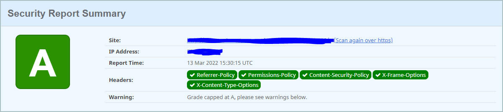

# Security

In Pode v2.6.0 support was added for HTTP [security headers](https://badgerati.github.io/Pode/Tutorials/Middleware/Types/Security/) to be automatically added to requests, such as: Access Control, Cross-Origin, Content Security Policy, and more.

Pode.Web uses this feature to automatically set some default headers on requests, to make your site more secure.

## Options

To set which security type to use, you can optionally specify a type via the `-Security` parameter on [`Use-PodeWebTemplates`](../../Functions/Utilities/Use-PodeWebTemplates). The valid values are: None, Default, Simple, and Strict.

```powershell
Use-PodeWebTemplates -Title 'Test' -Theme Dark -Security Simple
```

In the case of the Default, Simple and Strict types: Pode.Web uses the inbuilt security types within Pode (simple for default), and adds some extra essential default Content Security Policy rules to allow Pode.Web to function:

```plain
* script-src: self, unsafe-inline
* style-src: self, unsafe-inline
* image-src: self, data
```

The `unsafe-inline` values for scripts and styles are required due to Pode.Web templates currently have inline JavaScript and CSS - this could change in the future, and the values removed.

### None

This type is pretty self-explanatory, if specified Pode.Web will call `Remove-PodeSecurity` to remove all security headers.

### Default

This type is the default that Pode.Web uses when no `-Security` is supplied. Under the hood this type uses the Simple security type within Pode, plus some extras:

* The default-src, script-src, style-src, and media-src for Content Security Policy are extended with `http` and `https`, to allow content to be retrieved externally
* The Cross-Origin headers are removed
* The essentials above

### Simple

This is just the [Simple](https://badgerati.github.io/Pode/Tutorials/Middleware/Types/Security/#simple) security type within Pode, plus the essentials mentioned above.

### Strict

This is just the [Strict](https://badgerati.github.io/Pode/Tutorials/Middleware/Types/Security/#strict) security type within Pode, plus the essentials mentioned above.

## Content Not Loading

If you're using the Simple or Strict types, and you find that media isn't loading, then you likely need to add extra Content Security Policy rules. In the Default type, http/https is added to prevent this from occurring, so the same should work also:

```powershell
Add-PodeSecurityContentSecurityPolicy `
    -Default 'http', 'https' `
    -Style 'http', 'https' `
    -Scripts 'http', 'https' `
    -Image 'http', 'https'
```

However, if you want to control it more granularly, then you'll need to specify the URLs for media appropriately. For example, if you were loading audio from `https://samplelib.com` then you'd need to add:

```powershell
Add-PodeSecurityContentSecurityPolicy -Media 'https://samplelib.com'
```

The same also applies to styles and scripts as well.

## Misc

### HSTS

If you need to enable HSTS for your site, you can do so vua supplying the `-UseHSTS` switch on [`Use-PodeWebTemplates`](../../Functions/Utilities/Use-PodeWebTemplates).

### Rating

Using [securityheaders.com](https://securityheaders.com) on a Pode.Web site hosted publicly with the `-Security` set as Default, an A rating is achieved:


