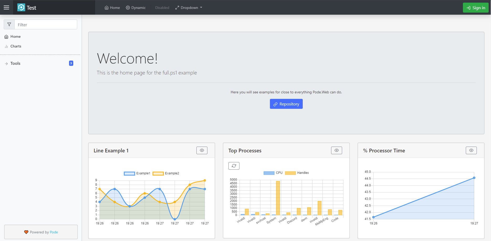
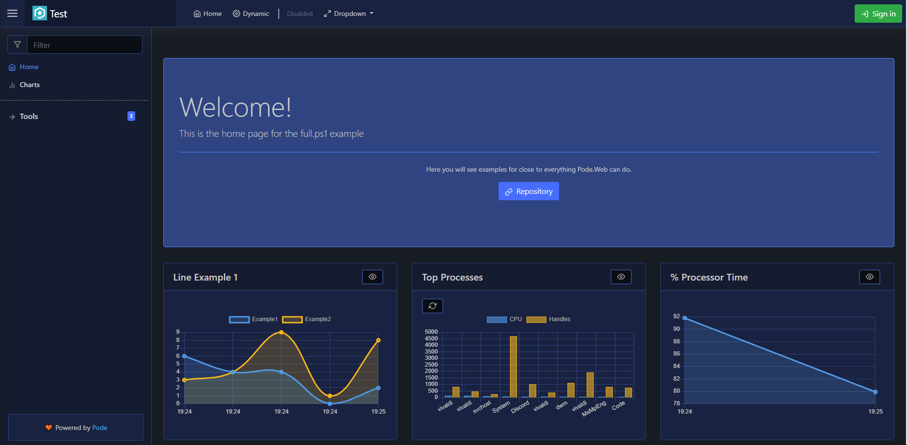
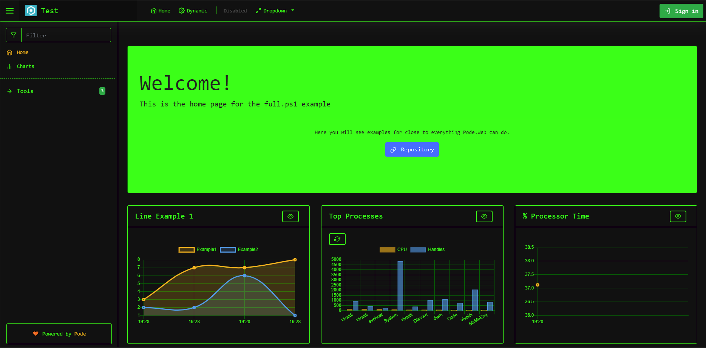

# Themes

Pode.Web comes with some inbuilt themes (including a dark theme!), plus the ability to use custom themes. Themes are set using [`Use-PodeWebTemplates`](../../Functions/Utilities/Use-PodeWebTemplates).

## Inbuilt

Pode.Web has 4 inbuilt themes:

* Light
* Dark
* Terminal (black/green)
* Auto (uses the user's system theme)

For example, to use the `Terminal` theme:

```powershell
Use-PodeWebTemplates -Title 'Example' -Theme Terminal
```

### Light



### Dark



### Terminal



## Custom

And there is also a `Custom` theme option, which will let you add your own custom themes via [`Add-PodeWebCustomTheme`](../../Functions/Utilities/Add-PodeWebCustomTheme), which you can supply a URL for the custom CSS:

```powershell
Use-PodeWebTemplates -Title 'Example' -Theme Custom
Add-PodeWebCustomTheme -Name 'Custom1' -Url 'https://example.com/custom-theme.css'
```

The first custom theme you add is the default theme.

## Set the Theme

You can override the default theme on a per user basis, by either setting the `pode.web.theme` cookie on the frontend, or by setting a `Theme` property in the user's authentication object:

```powershell
New-PodeAuthScheme -Form | Add-PodeAuth -Name Example -ScriptBlock {
    param($username, $password)

    return @{
        User = @{
            Theme = 'Light'
        }
    }
}
```

The theme that gets used is defined in the following order:

1. Cookie
2. User Authentication
3. Server Default

You can also use the [`Update-PodeWebTheme`](../../Functions/Actions/Update-PodeWebTheme) and [`Reset-PodeWebTheme`](../../Functions/Actions/Reset-PodeWebTheme) actions.
