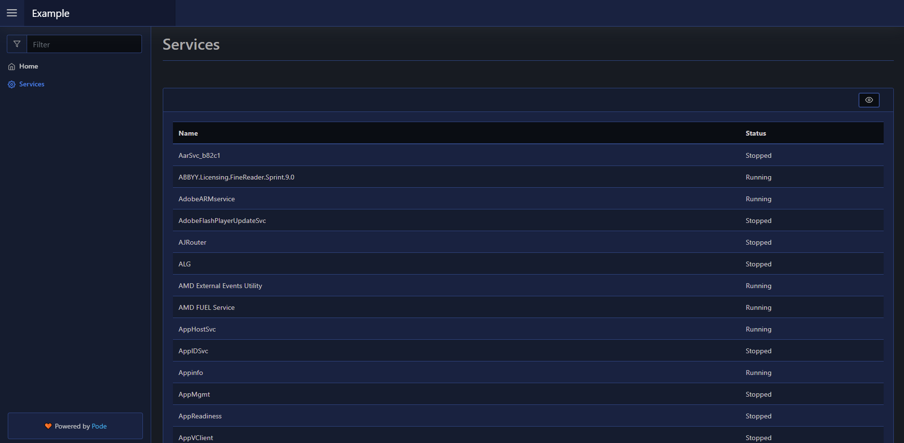

# Welcome!

[](https://raw.githubusercontent.com/Badgerati/Pode.Web/master/LICENSE.txt)
[](https://actions-badge.atrox.dev/badgerati/pode.web/goto)
[](https://discord.gg/fRqeGcbF6h)
[](https://github.com/sponsors/Badgerati)

> 💝 A lot of my free time, evenings, and weekends goes into making Pode happen; please do consider sponsoring as it will really help! 😊

This is a web template framework for use with the [Pode](https://github.com/Badgerati/Pode) PowerShell web server (v2.2.0+).

It allows you to build web pages purely with PowerShell - no HTML, CSS, or JavaScript knowledge required!

You can build charts, forms, tables, general text, tabs, login pages, etc. There's a light, dark, and terminal themes, and you can supply a custom CSS file.

[](./Getting-Started/Installation)
[](#quick-look)

## 🚀 Features

* Like [Pode](https://github.com/Badgerati/Pode), this is already cross-platform! (with support for PS5)
* Easily add pages, with different layouts and elements
* Support for authentication with a login page!
* Create line, bar, pie, and doughnut charts
* Support for forms, with all kinds of input elements
* Show toast messages on the page, or send desktop notifications
* Display data in tables, with pagination, sorting and filtering
* Use a stepper for a more controlled flow of form input
* Or, use a tabs layout for your pages!
* Show or right code via the Monaco editor (still WIP)
* Render code in code-blocks with code highlighting!
* Support for Light, Dark, Terminal, and custom themes

## 📦 Libraries

The Pode.Web templates are built using [Bootstrap](https://getbootstrap.com), [jQuery](https://jquery.com), [Material Design Icons](https://materialdesignicons.com), [Chart.js](https://www.chartjs.org), and [Highlight.js](https://github.com/highlightjs/highlight.js).

## 🔥 Quick Look!

Below is a quick example of using Pode.Web to create a page with a table of all services, and be available at `http://localhost:8080/pages/services`:

```powershell
Import-Module Pode.Web

Start-PodeServer {
    Add-PodeEndpoint -Address localhost -Port 8080 -Protocol Http

    Use-PodeWebTemplates -Title 'Example' -Theme Dark

    Add-PodeWebPage -Name 'Services' -Icon 'Settings' -ScriptBlock {
        New-PodeWebCard -Content @(
            New-PodeWebTable -Name 'Services' -ScriptBlock {
                foreach ($svc in (Get-Service)) {
                    [ordered]@{
                        Name   = $svc.Name
                        Status = "$($svc.Status)"
                    }
                }
            }
        )
    }
}
```

And this will render a page that looks as follows:



[](./Getting-Started/Installation)
